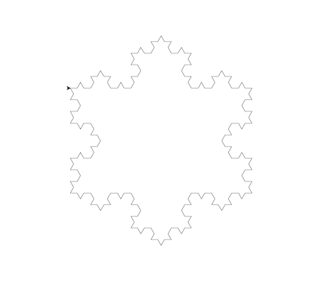

# Домашнє завдання 2

## Опис

Домашнє завдання буде складатися з двох незалежних завдань.

## Зміст

-   [Завдання 1](#завдання-1)
-   [Завдання 2](#завдання-2)

## Завдання 1

Напишіть програму на Python, яка рекурсивно копіює файли у вихідній директорії, переміщає їх до нової директорії та сортує в піддиректорії, назви яких базуються на розширенні файлів.

Домашнє завдання виконано у файлі task_1.py.

Наступні параметри будуть використані за замовчуванням, якщо не було передано з командного рядку жодного:

-   вихідна папка: `source`
-   кінцева папка: `dist`

### Приклад запуску програми

```
python task_1.py [вихідна папка] [кінцева папка]
```

```
python task_1.py source
python task_1.py source dist
```

### Приклад роботи програми

```
Вихідна папка "source", кінцева папка "dist"

dist
├── .jpg
    ├── img.jpg
    └── new_image.JPG
└── .png
    └── image.png
```

## Завдання 2

Напишіть програму на Python, яка використовує рекурсію для створення фракталу «сніжинка Коха» за умови, що користувач повинен мати можливість вказати рівень рекурсії.

Домашнє завдання виконано у файлі task_2.py.

Наступні параметри будуть використані за замовчуванням, якщо не було передано з командного рядку жодного:

-   рівень рекурсії: `3`
-   розмір: `500`

### Приклад запуску програми

```
python task_2.py [рівень рекурсії] [розмір]
```

```
python task_2.py 3
python task_2.py 3 500
```

### Приклад роботи програми


